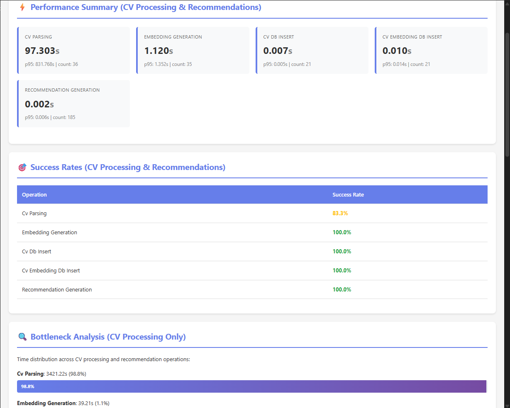
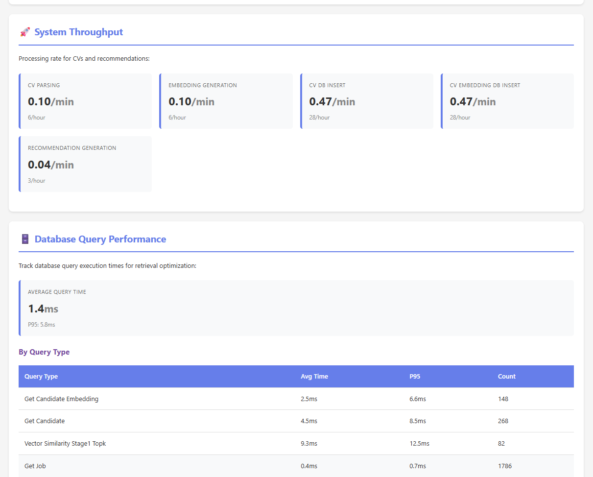

# CV Parsing and Job Matching System

This repository implements a CV/Resume parsing and job recommendation system focused on: NLP / LLM-driven parsing, vector embeddings & semantic search (pgvector + Redis cache), explainable matching, and performance-aware retrieval and long with qualitative and performance evaluation metrics. Also, it contains an extra layer of security to prevent people trying to fool AI models.

---

**Contents**
- **Overview**: high-level architecture and components
- **Installation & Quick Start**: environment, DB, and quick commands
- **Modules & Responsibilities**: mapping of source files to functionality
- **How the Assignment Tasks Are Covered**: Task 1–5 mapping to code
- **Security & Robustness**: prompt-injection, embedding manipulations, logging
- **Performance & Scaling**: two-stage retrieval, batching, caching, metrics
- **Evaluation Pipeline**: ground-truth generation and metrics calculation
- **Scripts & Useful Commands**n- **Testing**: tests present and how to run them
- **Further Improvements & Notes**

---

**Overview**:
- **Goal**: Parse PDF resumes into standardized JSON (JSON Resume schema-like structure), create embeddings for CVs and jobs, and compute ranked job recommendations per candidate using a multi-factor scoring system (skills, experience, education, semantic similarity).
- **Main techniques**: LLM-powered parsing (LangChain wrappers for Azure/OpenAI or Google Gemini), SentenceTransformers embeddings, pgvector for vector storage & similarity, optional Redis caching for high-throughput similarity, and multi-factor reranking.
- **Design principles**: Defensive parsing (non-breaking on detected threats), embedding normalization to avoid manipulation, two-stage retrieval for performance, and rich telemetry via a performance monitor.

---

**Installation & Quick Start**

Please refer to [README.md](https://github.com/thenaivekid/CV_parser_and_recommender)

---

**Repository Layout (important files)**
```md
.
├── DOCUMENTATION.md
├── README.md
├── configurations
├── data #sample data
├── docker-compose.yml #to init postgresql in a docker container
├── postgres # init file to create tables and indices
├── requirements.txt
├── resume-dataset
├── scripts # bash scripts to run the modules
├── src # main implementation python codes
└── tests # unit tests
```

- `src/` : main source
  - `cv_parser.py` : LLM-based PDF resume parsing (LangChain templates + robust validation)
  - `embedding_generator.py` : Normalization, skill deduplication, embedding generation (SentenceTransformers)
  - `database_manager.py` : All PostgreSQL CRUD, pgvector similarity SQL, batch inserts, metrics persistence
  - `recommendation_engine.py` : Multi-factor scoring (skills, experience, education, semantic), explanation generation
  - `generate_recommendations.py` : Parallel orchestration for generating recommendations (ThreadPoolExecutor)
  - `cache_manager.py` : Redis-backed cache for job embeddings + NumPy similarity; `CachedRecommendationEngine`
  - `process_cvs.py` : Batch processing entrypoint, orchestrates parsing → embed → DB inserts (parallel option)
  - `cv_batch_processor_utils.py` : `BatchProcessor`, `ParallelBatchProcessor` implementations
  - `generate_ground_truth.py` : Simple ground truth generator used in evaluation pipeline
  - `evaluate_recommendations.py` : Evaluation framework (Precision@K, Recall@K, F1@K) with batched & parallel evaluation
  - `performance_monitor.py`, `metrics_collector.py` : Performance tracking, decorators, persistence
  - `config.py` : YAML-based config loader + env-based DB config

- `configurations/config.yaml` : Default configuration (embedding model, two-stage params, redis config)
- `requirements.txt` : dependencies list
- `scripts/` : convenience scripts for init, batch runs, evaluation, redis install
- `data/` : sample outputs, evaluations, recommendations
- `tests/` : unit tests for core components (embedding normalization, redis cache, security, perf)

---

**How Assignment Tasks Are Fulfilled (mapping to repo)**

- Task 1 — CV/Resume Parsing (JSON Resume Schema)
  - Implemented in `src/cv_parser.py`.
  - Uses `langchain_core` prompt templates and either Azure (`AzureChatOpenAI`) or Google Gemini (`ChatGoogleGenerativeAI`) as the LLM provider.
  - Extracted fields (via `ResumeData` Pydantic model): `basics`, `summary`, `work`, `education`, `skills` (technical + soft), `certifications`, `achievements`, `languages`.
  - Robust PDF reading with `pypdf`, cleaning, retry logic (3 attempts), and validation of parsed JSON. Output conforms to a JSON structure matching the expected schema.

- Task 2 — Job Recommendation System
  - Core ranking logic is in `src/recommendation_engine.py`.
  - Multi-factor scoring components:
    - `calculate_skills_match` — technical (70%) + soft (30%) scoring and matched/missing skills output
    - `calculate_experience_match` — computes years from work history and scores against min/max requirements
    - `calculate_education_match` — degree hierarchy and field match
    - `calculate_semantic_similarity` — cosine similarity on embeddings (normalized to 0..1)
    - `calculate_overall_match` — weighted aggregation of the above
    - `generate_explanation` — human-readable explanation combining factor results
  - Retrieval strategies implemented in `src/database_manager.py` and `src/cache_manager.py`:
    - `pgvector` SQL-based similarity: pre-computed similarities in SQL via `1 - (je.embedding <=> ce.embedding)`
    - `get_top_k_jobs_by_similarity` → Stage 1 filtering (fast)
    - `rank_jobs_for_candidate` → Stage 2 reranking using multi-factor scoring
  - Orchestration & parallel execution: `src/generate_recommendations.py` (ThreadPoolExecutor) and `generate_recommendations_for_candidate` for single candidate.

- Task 3 — Performance Optimization
  - Two-stage retrieval reduces Python-side scoring to a shortlist (`stage1_top_k`, default 50).
  - Batch inserts: `DatabaseManager.save_recommendations_batch` uses `psycopg2.extras.execute_values`.
  - DB-side similarity computation leverages `pgvector` index and computes similarity in SQL for best throughput.
  - Optional Redis caching + NumPy similarity in `src/cache_manager.py` to avoid DB round-trips and do vectorized cosine similarity across many jobs.
  - Performance telemetry: `src/performance_monitor.py` and `src/metrics_collector.py` collect operation and query metrics, sessions, and system snapshots. The code records metrics and persists to DB.

- Task 4 — Advanced Retrieval Techniques (Performance-Aware)
  - Two-stage retrieval (Stage 1: fast pgvector top-k; Stage 2: rerank by full scoring) is implemented and configurable via `configurations/config.yaml`.
  - Redis cache + vectorized NumPy computing implemented in `src/cache_manager.py` for extreme throughput; method `CachedRecommendationEngine.get_similar_jobs` is available.
  - DB queries use LIMIT + ORDER BY on vector distances so pgvector can use IVFFLAT.

- Task 5 — Recommendation Evaluation Pipeline
  - `src/generate_ground_truth.py` produces a ground truth JSON using configurable profession ↔ relevant job mappings.
  - `src/evaluate_recommendations.py` loads ground truth and DB recommendations, computes Precision@K, Recall@K, and F1@K in parallel (batches + ProcessPoolExecutor), and exports results to `data/performance_reports/`.

---

**Security & Robustness**

- Prompt injection / LLM safety
  - `cv_parser.py` builds prompt templates using explicit `<RESUME>...</RESUME>` delimiters and a set of hard rules in the system message to force the LLM to only extract explicit content.
  - `src/security_utils.py` (referenced by `cv_parser`) contains sanitization, regex-based threat detection patterns, output validation, and anomaly reporting (logged to DB via `DatabaseManager.log_suspicious_resume`).

- Embedding poisoning protections
  - `src/embedding_generator.py` performs text normalization, removes invisible chars, caps repetition (keyword stuffing detection), normalizes skill synonyms and fuzzy deduplication (SequenceMatcher, 80% threshold), and caps skill count to 50.

- Non-breaking design
  - Threats/anomalies are recorded, but parsing continues with fallback / minimal structure to keep pipelines running.

---

**Performance & Scaling Details**

- Two-stage retrieval parameters in `configurations/config.yaml`:
  - `use_two_stage` (bool), `stage1_top_k`, and `stage1_threshold` control Stage 1 behavior.
- Parallelism
  - Candidate-level parallelism: `src/generate_recommendations.py` uses `ThreadPoolExecutor` (configurable `--workers`).
  - CV processing parallelism: `src/process_cvs.py` uses `ParallelBatchProcessor` which uses multiprocessing Pool.
- Caching
  - `src/cache_manager.py` stores job embeddings in Redis and computes cosine similarity with NumPy vectorization (fast, memory-bound). Cache key: `job_embeddings_v1`.
- Database optimizations
  - pgvector usage: similarity operator `<=>` and `1 - (je.embedding <=> ce.embedding)` to compute similarity in SQL.
  - SQL uses ORDER BY + LIMIT to leverage index for Stage 1.

---

**Evaluation & Metrics**

- Recommendation quality metrics: `Precision@K`, `Recall@K`, `F1@K` computed in `src/evaluate_recommendations.py`.
- Performance metrics: `src/performance_monitor.py` records operation durations, query timings, system snapshots, and writes them into DB (tables: `performance_metrics`, `query_performance`, `system_metrics`, `processing_sessions`).
- Performance dashboard generator: `src/generate_performance_dashboard.py` and `src/dashboard_generator.py` (exists to build HTML reports from metrics) — used to export visual reports into `data/performance_reports/`.

---

**Testing**

- Unit tests live in `tests/` with these notable tests:
  - `test_embedding_normalization.py` — verifies skill deduplication and stuffing detection
  - `test_redis_cache.py` & `test_redis_recommendations.py` — cache behavior
  - `test_performance_monitoring.py` — metrics recording
  - `test_security.py` — security validator tests

- Run tests:

```
./scripts/test_all.sh
```

Note: Some tests require DB and Redis available or can be run against mocked/stubbed configs.

---

**Where to Start When Extending or Inspecting Code**

- Parsing: open `src/cv_parser.py` — read prompt construction, `ResumeData` model, sanitization calls and retry logic.
- Embeddings: `src/embedding_generator.py` — text normalization, skill normalization map and fuzzy dedupe, embedding generation using SentenceTransformers.
- Storage & similarity: `src/database_manager.py` — examine SQL for `get_top_k_jobs_by_similarity` and `get_all_jobs_with_similarity_for_candidate`.
- Recommendation scoring: `src/recommendation_engine.py` — adjust weights or scoring functions.
- Caching: `src/cache_manager.py` — Redis-backed cache retrieval and vectorized similarity.
- Orchestration: `src/generate_recommendations.py` and `src/process_cvs.py` — entrypoints for recommendation generation and CV batch processing.

**Perf Dashboard**




---

**Known Limitations & Future Improvements**

- LLM provider abstraction is basic — rate limits, batching prompts to reduce cost, or more options for LLM APIs and local open-source model integration (e.g., Llama 2 via Hugging Face or Ollama) could be added.
- Fine-grained skill normalization could use an ontology (e.g., skill embeddings or mapping tables) instead of hard-coded synonyms.
- Education normalization and experience parsing can occasionally mis-handle ambiguous date formats — adding dedicated date parsers / heuristics can improve accuracy.
- Since nothing is mentioned about job descriptions, I assumed them to be a structured json and also added feature to parse jd pdf and store them to db.
- The evaluation ground truth in `generate_ground_truth.py` is synthetic; real evaluation requires curated labels.
